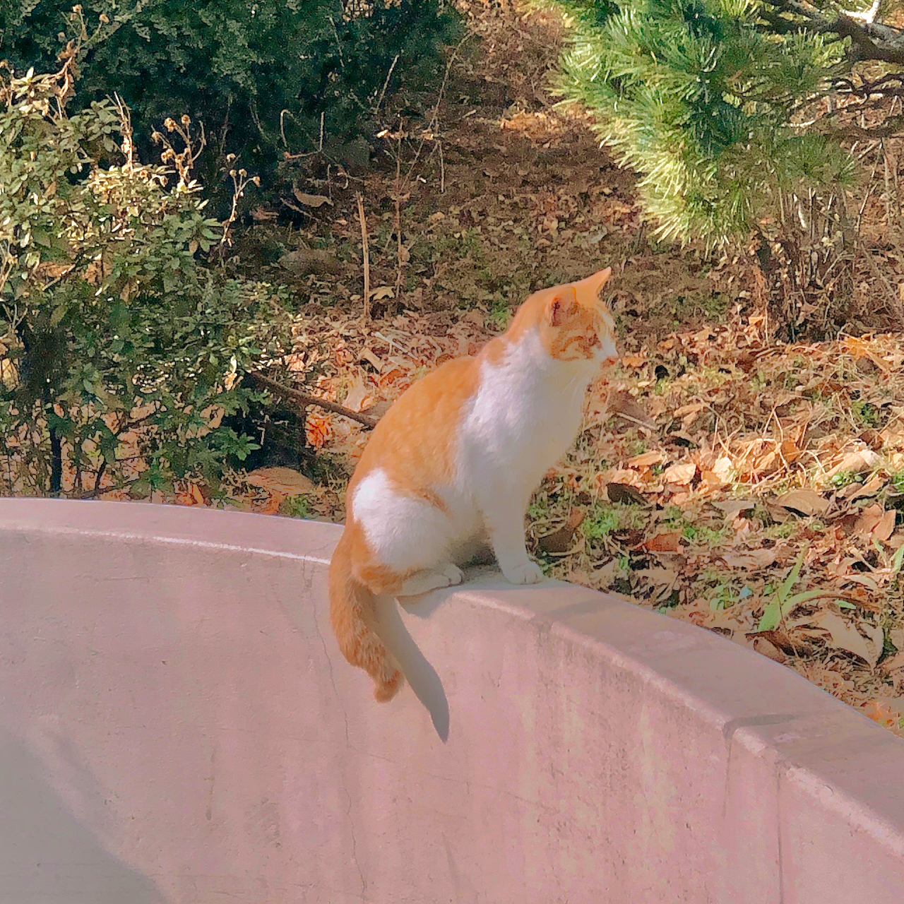

# opencv-video2cartoon
Simple cartoon video maker with opencv

## How
It cartoonizes video by using k-means clustering
### What is k-means clustering?
k-means clustering is a method of vector quantization, originally from signal processing,  
that aims to partition n observations into k clusters in which each observation belongs to the cluster with the nearest mean,  
serving as a prototype of the cluster.  
[Reference: https://en.wikipedia.org/wiki/K-means_clustering](https://en.wikipedia.org/wiki/K-means_clustering) 

Simply, large k value will show more color details and small k value will show less color details.

## Output
### Image
| original                        | k = 5                                                        | k = 10                                                         | k = 20                                                         |
|---------------------------------|--------------------------------------------------------------|----------------------------------------------------------------|----------------------------------------------------------------|
|  |  |  |  |
### Video
| original [PETS09-S2L1-raw.webm](PETS09-S2L1-raw.webm) | k = 5 [cartoonized_video_k5.avi](output%2Fcartoonized_video_k5.avi) | k = 10 [cartoonized_video_k10.avi](output%2Fcartoonized_video_k10.avi) | k = 20 [cartoonized_video_k20.avi](output%2Fcartoonized_video_k20.avi) |
|-------------------------------------------------------|---------------------------------------------------------------------|------------------------------------------------------------------------|------------------------------------------------------------------------|
|      |          |           |           |

## Limitation
- When k is 20, it has a lot of color details so it doesn't look like a cartoon
- When k is 5, it has less color details so it looks like cartoon.
- But, there are many green parts in the original video, so the video is generally green.
- It takes a long time to process the video
- It makes blinking video because it simply converts each frame and recombines them
